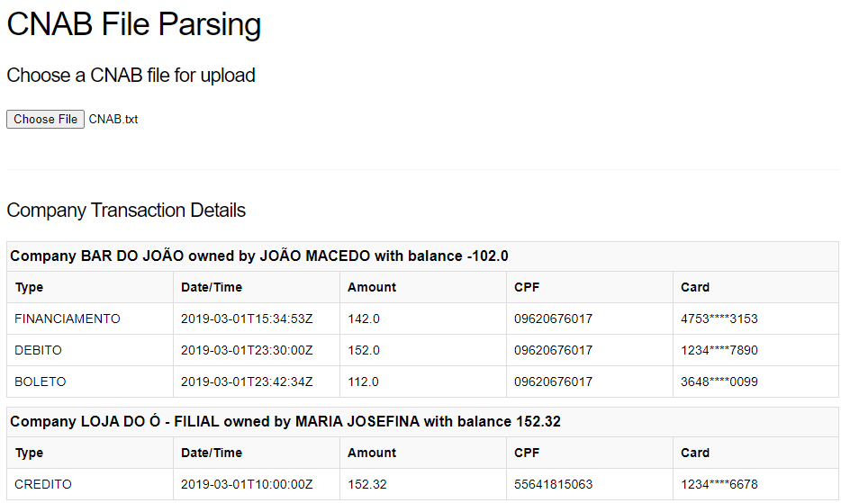

# cnab_file |> parse()

This is an application created aimed to fulfill the following challenge: [Desafio programação - para vaga desenvolvedor](https://github.com/ByCodersTec/desafio-dev)

## Configuring local environment

In order to run the application locally you must setup your local environment following the instructions bellow.

First we need to build our Docker images:

    $ docker-compose build

## Running application locally

Running application:

    $ docker-compose up

You can even build and run with a single command-line like following:

    $ docker-compose up --build

Now we can visit [ `localhost:4000` ](http://localhost:4000/) from a browser to access the app's interface.
And there you can upload a CNAB file like [this one](./test/fixtures/CNAB.txt) and see the results like the following screen shot:




## Testing the GraphQL APIs

Once the applications is up and running, we can try out the APIs by visiting [ `localhost:4000/api/graphiql` ](http://localhost:4000/api/graphiql) from a browser to access GraphiQL Workspace. The GraphiQL Workspace is GUI where we can edit and test GraphQL queries and mutations.

### Company Transactions Query

In order to fetch all financial transactions, we can use the following query as example:

``` graphql
query {
  companyTransactions {
    balance
    ownerName
    tradingName
    transactions {
      amount
      card
      cpf
      occurredAt
      transactionType
    }
  }
}
```

Or if you wish to test with command line, you can try:

    $ curl 'http://localhost:4000/api/graphql' -H 'content-type: application/json' --data-raw '{ "variables": {}, "query": "{ companyTransactions { balance ownerName tradingName transactions { amount card cpf occurredAt transactionType } } }" }'

Both ways should return a result like this:

``` json
{
  "data": {
    "companyTransactions": [
      {
        "balance": "-102.0",
        "ownerName": "JOÃO MACEDO",
        "tradingName": "BAR DO JOÃO",
        "transactions": [
          {
            "amount": "142.0",
            "card": "4753****3153",
            "cpf": "09620676017",
            "occurredAt": "2019-03-01T15:34:53Z",
            "transactionType": "FINANCIAMENTO"
          },
          {
            "amount": "152.0",
            "card": "1234****7890",
            "cpf": "09620676017",
            "occurredAt": "2019-03-01T23:30:00Z",
            "transactionType": "DEBITO"
          },
          {
            "amount": "112.0",
            "card": "3648****0099",
            "cpf": "09620676017",
            "occurredAt": "2019-03-01T23:42:34Z",
            "transactionType": "BOLETO"
          }
        ]
      },
      {
        "balance": "152.32",
        "ownerName": "MARIA JOSEFINA",
        "tradingName": "LOJA DO Ó - FILIAL",
        "transactions": [
          {
            "amount": "152.32",
            "card": "1234****6678",
            "cpf": "55641815063",
            "occurredAt": "2019-03-01T10:00:00Z",
            "transactionType": "CREDITO"
          }
        ]
      },
      {
        "balance": "230.0",
        "ownerName": "MARIA JOSEFINA",
        "tradingName": "LOJA DO Ó - MATRIZ",
        "transactions": [
          {
            "amount": "102.0",
            "card": "6228****9090",
            "cpf": "55641815063",
            "occurredAt": "2019-03-01T00:00:00Z",
            "transactionType": "ALUGUEL"
          },
          {
            "amount": "200.0",
            "card": "1234****3324",
            "cpf": "55641815063",
            "occurredAt": "2019-03-01T09:00:02Z",
            "transactionType": "DEBITO"
          },
          {
            "amount": "132.0",
            "card": "3123****7687",
            "cpf": "55641815063",
            "occurredAt": "2019-03-01T14:56:07Z",
            "transactionType": "RECEBIMENTO_EMPRESTIMO"
          }
        ]
      },
      {
        "balance": "489.2",
        "ownerName": "MARCOS PEREIRA",
        "tradingName": "MERCADO DA AVENIDA",
        "transactions": [
          {
            "amount": "102.03",
            "card": "2344****1222",
            "cpf": "84515254073",
            "occurredAt": "2019-03-01T12:32:22Z",
            "transactionType": "RECEBIMENTO_DOC"
          },
          {
            "amount": "2.0",
            "card": "2344****1222",
            "cpf": "84515254073",
            "occurredAt": "2019-03-01T12:32:22Z",
            "transactionType": "RECEBIMENTO_DOC"
          },
          {
            "amount": "107.0",
            "card": "8723****9987",
            "cpf": "84515254073",
            "occurredAt": "2019-03-01T12:33:33Z",
            "transactionType": "BOLETO"
          },
          {
            "amount": "802.0",
            "card": "3123****7687",
            "cpf": "84515254073",
            "occurredAt": "2019-03-01T14:56:07Z",
            "transactionType": "RECEBIMENTO_EMPRESTIMO"
          },
          {
            "amount": "192.0",
            "card": "6777****1313",
            "cpf": "84515254073",
            "occurredAt": "2019-03-01T17:27:12Z",
            "transactionType": "FINANCIAMENTO"
          },
          {
            "amount": "122.0",
            "card": "6777****1313",
            "cpf": "84515254073",
            "occurredAt": "2019-03-01T17:27:12Z",
            "transactionType": "FINANCIAMENTO"
          },
          {
            "amount": "502.0",
            "card": "8473****1231",
            "cpf": "84515254073",
            "occurredAt": "2019-03-01T23:12:33Z",
            "transactionType": "BOLETO"
          },
          {
            "amount": "506.17",
            "card": "1234****2231",
            "cpf": "84515254073",
            "occurredAt": "2019-06-01T10:00:00Z",
            "transactionType": "CREDITO"
          }
        ]
      },
      {
        "balance": "-7023.0",
        "ownerName": "JOSÉ COSTA",
        "tradingName": "MERCEARIA 3 IRMÃOS",
        "transactions": [
          {
            "amount": "109.0",
            "card": "8723****9987",
            "cpf": "23270298056",
            "occurredAt": "2019-03-01T12:33:33Z",
            "transactionType": "BOLETO"
          },
          {
            "amount": "5.0",
            "card": "7677****8778",
            "cpf": "23270298056",
            "occurredAt": "2019-03-01T14:18:08Z",
            "transactionType": "BOLETO"
          },
          {
            "amount": "6102.0",
            "card": "6777****1313",
            "cpf": "23270298056",
            "occurredAt": "2019-03-01T17:27:12Z",
            "transactionType": "FINANCIAMENTO"
          },
          {
            "amount": "602.0",
            "card": "6777****1313",
            "cpf": "23270298056",
            "occurredAt": "2019-03-01T17:27:12Z",
            "transactionType": "FINANCIAMENTO"
          },
          {
            "amount": "103.0",
            "card": "6777****1313",
            "cpf": "23270298056",
            "occurredAt": "2019-03-01T17:27:12Z",
            "transactionType": "FINANCIAMENTO"
          },
          {
            "amount": "102.0",
            "card": "8473****1231",
            "cpf": "23270298056",
            "occurredAt": "2019-03-01T23:12:33Z",
            "transactionType": "BOLETO"
          }
        ]
      }
    ]
  }
}
```

### File Upload Mutation

Last but not least, we can upload a cnab file using the following example:

    $ curl -X POST -F query="mutation { uploadFile(file: \"cnab_file\")}" -F cnab_file=@test/fixtures/CNAB.txt localhost:4000/api/graphql

And the query result should be something like that:

``` json
{
  "data": {
    "uploadFile": "file_uploaded_succesfully"
  }
}
```

After that it's possible to check the result by using the `Company Transactions Query`, accessing the app [ `localhost:4000` ](http://localhost:4000/) or even straight to the database instace using the following commands:
```bash
docker exec -it bycoders_cnab_db_1 psql -U postgres
psql (14.3 (Debian 14.3-1.pgdg110+1))
Type "help" for help.

postgres=# \c bycoders_cnab_dev 
You are now connected to database "bycoders_cnab_dev" as user "postgres".
bycoders_cnab_dev=# select * from transactions;
```


## Code Quality

In order to enforcing a sort of code quality, code coverage and hopefully free of bugs the following Elixir tools was adopted on the project.

- [Credo](https://github.com/rrrene/credo): Is a static code analysis tool that isresponsible for checking if the code is adherent to common good code practices established by the community.
```bash
$ mix credo
```
- [ExCoveralls](https://github.com/parroty/excoveralls): Is a library that reports test coverage statistics
```bash
$ mix coveralls.html
```
- [Dialyxir](https://github.com/jeremyjh/dialyxir): Is a tool that helps you find discrepancies in your code, such as: Type errors, Code that raises exceptions, Unsatisfiable conditions, Redundant code, Race conditions
```bash
$ mix dialyzer
```
- [Sobelow](https://github.com/nccgroup/sobelow): Is a security-focused static analysis tool that can detects security issues like: Cross-Site Scripting, SQL injection, Command injection, Code execution, Denial of Service and so on
```bash
$ mix sobelow --config
```
Two mix tasks (alias) were created to make the execution of them all simple:
`quality` and `quality.ci`. The first one could be run on a dev environment and the last should be run on a CI/CD pipeline because it breaks the flow when an error was found.

```bash
$ mix quality
$ mix quality.ci
```